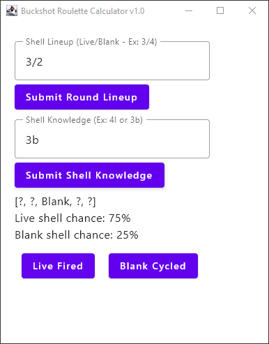

# buckshot-routlette-calculator

This is a tool written in Kotlin for the
game [Buckshot Roulette](https://store.steampowered.com/app/2835570/Buckshot_Roulette/)
that calculates the chance of the current shell in the shotgun being a blank or a
live shell.

## Installation

1. Download
   the [latest release](https://github.com/actual-kwarter/buckshot-routlette-calculator/releases)
   (portable `.exe` or installable `.msi` available).
2. Run the application.

## Usage

1. At the start of a new round, input the shell lineup in a "Live/Blank" format.
   Example: There are three live shells and two blank shells, you would input
   "3/2".
2. Submit the round lineup and the fields below will update.
3. If you have knowledge items such as the burner phone or magnifying glass, you can
   input shell knowledge in a "Location/Shell Type" format. Example: If the phone
   tells you that the fourth shell is a blank, you would input "4b".
4. For each shell that is fired/cycled through the shotgun, click the respective
   Live/Blank buttons. The odds will be updated automatically as you proceed.
5. To reset at the start of a new round, just enter a new shell lineup and submit.

Good luck!
